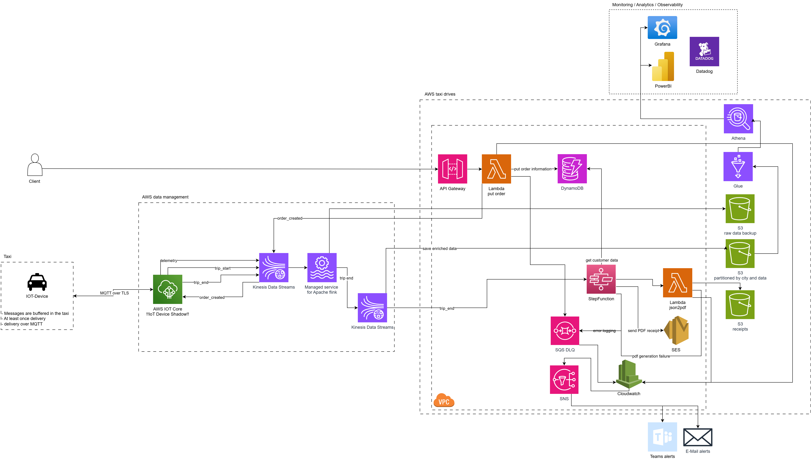
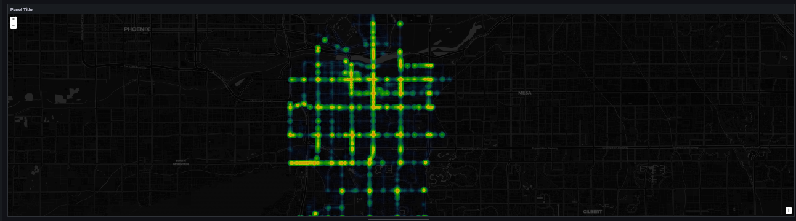
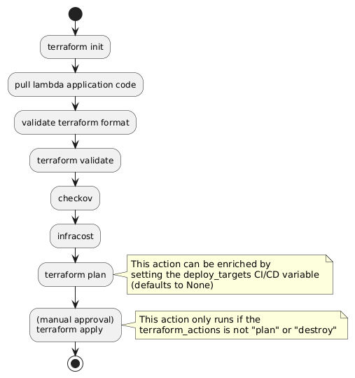

# taxi-platform
Scalable, event-driven backend platform for real-time taxi operations and data enrichment

# Assumptions
- Focus lies on Data availability rather than just in time data arrival -> At least once delivery of data
- Data alyways need to be encrypted at rest and in transit
- Zero Trust principle needs to be applied
- The scalability of the application needs to be ensured
- How to take care of historical data
- What makes the best use as a data storage
- Define tooling for data analytics
- Telemetric data is transfered every 5 seconds
- MQTT can be used as transmission protocol
- Data needs to be buffered locally in case of connectivity loss
- Kernel Density Estimation needs to be ensured for proper taxi placement

# 1. Architecture



## 1.1 Solution overview
The architecture is divided into several sections:
- Taxi
    - IOT-Device running in the taxi's itself
- Client
    - Client communication towards the platform
- AWS Data Management
    - Logic for the complete data ingestion and data preparation
- AWS taxi drives
    - Logic for the complete application and data storage
- Monitoring/Analytics/Observability
    - Logic to ensure Monitoring, Analytics and Observability requirements

## 1.2 Data flow 

The data flow of the application is designed in a specific manner.

1. A new order must always be sent by the customer to avoid a new trip can be started by the driver without any customer
2. The request gets forwarded to the API-Gateway which triggers a Lambda function to put the order information into a DynamoDB. 
3. The triggered Lambda function sends an event to Kinesis Data Streams (order_created) which gets delivered to the AWS IOT-Core
4. The message arrives at the proper Taxi by using the MQTT-Protocol
5. The Driver now needs to accept the order and by doing so a new event (trip_start) gets sent to the IOT core
6. The IOT core is set up to send messages towards the Kinesis Data Streams which forwards this to Managed Service for Apache Flink 
7. In Apache Flink the initial trip_start message is received. Based on this initial information, Flink will calculate the city by using the reverse-geocoding tool `Nominatim`. All messages are also backed up to a raw s3 bucket to ensure no data can be lost even in case of a failure of flink.
8. Now the periodic telemetric update starts. The IOT-Device in the taxi will start transfering location updates every 5 seconds. Those will again be sent over IOT-Core and Kinesis Data Streams towards Flink. Flink will enrich the initial message with the periodic location updates coming from the telemetric updates. Based on this a full location traceability is given based on 5 second intervals. Based on this Flink will also calculate the total travelled distance
9. As soon as the destination has been reached, the Taxi sends an termination event (trip_end) to the IOT-Core, Kinesis Data Streams and Flink. 
10. Flink receives the trip_end event and prepares an enriched message (order infromation, trip information, location information, total distance and estimated city) to send to another Kinesis Data Stream. 
11. The enriched message is sent to an AWS Step Function to provide a logical order of tasks which should be fulfilled
    - Get detailed customer Data which was stored in the DynamoDB before by using the orderID from the enriched message
    - Use the complete information to trigger a lambda function `json2pdf` which generates an Receipt by using a HTML-Template which has a pre-defined variable setting for the message data. The generated receipt will then be stored in an s3 bucket `receipts`
    - The generated receipt will be sent to the customer via E-Mail by using custom E-Mail Templates in AWS SES
    - In case the lambda fails during the pdf generation, an event to the SQS queue will be sent to ensure all processing failures are stored in a central queue.
12. Additionally the data is delivered to an s3 bucket `enriched data` by using a proper partitioning based on city and date
12. Existing messages in the Error SQS-Queue will be used for an custom Alerting action
13. The partitioned data is used by a glue crawler to ensure data lake capabilities in the form of an glue database with glue tables
14. The created tables can be used in Athena to ensure proper SQL based queries. 
15. Monitoring can be ensured by using Grafana
16. Analytics can be ensured by using Tools such as PowerBI or AWS Quicksight, Apache Superset, or similar. The revenue per city is available as the data has a proper City information based on the trip_start location reverse-geocoding. Also the length of the trips is available as this has been calculated within Flink.
17. End-to-End Observability is ensured by using DataDog for the complete AWS account

## 1.3 Optimal taxi placement

One requirement flr the application is the proper placement of taxis throughout the various cities. To provide an manual management insight based on the available data we can use Grafana as visualization tool by making use of the heatmap feature when using geodata. 
The optimal placement of taxis can be ensured by using a combination of time series and geodata [trip start time and trip start location (lat/lon)] in Grafana.



This test data has been evaluated by using test data of car crashes in the city of Tempe in Arizona. The dataset can be found [here](https://data.tempe.gov/datasets/tempegov::1-08-crash-data-report-detail/about). By using this data we can already see corners in the city which are most likely more dangerous than others. This is because the data points are clustered in specific areas of the city. The heatmap shows the density of the data points in a specific area. The more data points are available in a specific area, the more red the area will be shown in the heatmap.


The visualization in our usecase allows to detect specific hotspots throughout the city as there will be more clustered data points in comparison to other places in the city. This is because we have places of common interest (Train stations, sightseeing attractions, stadiums, etc.) which will mark an optimal taxi placement.

# 2. Automation

Terraform will be the main way of deploying this application to AWS. The pipeline itself looks like the following:



In theory there are 2 major variables which can be used when triggering the pipeline:
- `terraform_actions`
    - `plan` -> This will only create a plan of the changes which will be applied to the AWS account. This is used for testing purposes and can be used to check if the pipeline is working as expected.
    - `destroy` -> This will destroy the complete infrastructure which has been created by the pipeline. This is used for testing purposes and can be used to check if the pipeline is working as expected.
    - `apply` -> This is the default action so this will be used when no other action is specified. This will apply the changes to the AWS account and create the complete infrastructure.
- `deploy_targets`
    - by setting a specific deploy target we can ensure that only a specific part of the infrastructure will be deployed. This functionality is given by using the `-target` flag in terraform. This is used for testing purposes and can be used to check if the pipeline is working as expected.
    All targets need to be defined in a list of strings and will be used to create the terraform command. The script which takes care of this looks like this:

    ```bash
    unset terraform_target
    deploy_target=("module.iam" "module.lambda.aws_lambda_function.json_to_pdf")
    for target in ${deploy_target[@]}; do 
        terraform_target="$terraform_target -target $target"
    done

        bash -c "terraform plan $terraform_target"
    ```

    This script for example will only deploy the IAM module and the lambda function `json_to_pdf` as well as its dependencies.

# 3. Data Exfiltration and Infiltration

- Use Encryption in each service (KMS for each service)
- Use TLS for complete communication
- Ensure encryption at rest and in transit
- Secret Secrets in Secrets Manager
- Private VPC Endpoints rather than public endpoint communication 
- Least privileges in IAM permissions (only scope access to specific purpose)
- Usage of Web application Firewall
- Fixed JWT payload with defined secret
- Use of API Gateway to ensure proper authentication and authorization
- Use of AWS GuardDuty to protect against malicious activity
- Use of AWS Inspector to protect against vulnerabilities
- Use of AWS Config to ensure compliance with security policies
- Use of AWS CloudTrail to ensure audit logging and monitoring


# Vision

- Move microservices to EKS
- Include AI Driven Decision processes
	- Demand forcasting
	- Dynamic pricing
    - Dynamic taxi placement
    - Dynamic route optimization
    - Real time ETA prediction
- Prepare for a multi-cloud strategy (GCP, Azure, etc.)
- Move to full product instead of IOT component (App which simplifies the order accepting process and offers traffic based route optimazation)
- Improve Self Service analytics capabilities by offering more data sources and data points
- Move to improved data lake structure with data warehousing and schema validation and evolving
- Ensure proper FinOps Methods (S3 glacier, moving components to central EKS)
- Ensure proper MLOps Methods (Model Monitoring, Model Governance, Model Observability)


